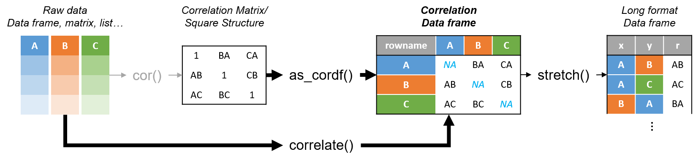
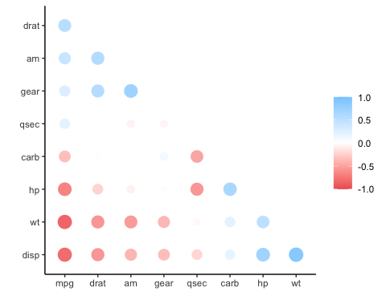
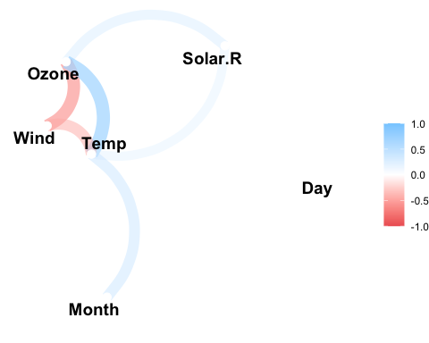

<!-- README.md is generated from README.Rmd. Please edit that file -->

# corrr <a href='https://corrr.tidymodels.org'></a>

<!-- badges: start -->

[](https://github.com/tidymodels/corrr/actions/workflows/R-CMD-check.yaml)
[](https://cran.r-project.org/package=corrr)
[](https://app.codecov.io/gh/tidymodels/corrr?branch=main)
<!-- badges: end -->

corrr is a package for exploring **corr**elations in **R**. It focuses
on creating and working with **data frames** of correlations (instead of
matrices) that can be easily explored via corrr functions or by
leveraging tools like those in the
[tidyverse](https://www.tidyverse.org/). This, along with the primary
corrr functions, is represented below:



You can install:

-   the latest released version from CRAN with

``` r
install.packages("corrr")
```

-   the latest development version from GitHub with

``` r
# install.packages("remotes") 
remotes::install_github("tidymodels/corrr")
```

## Using corrr

Using `corrr` typically starts with `correlate()`, which acts like the
base correlation function `cor()`. It differs by defaulting to pairwise
deletion, and returning a correlation data frame (`cor_df`) of the
following structure:

-   A `tbl` with an additional class, `cor_df`
-   An extra “term” column
-   Standardized variances (the matrix diagonal) set to missing values
    (`NA`) so they can be ignored.

### API

The corrr API is designed with data pipelines in mind (e.g., to use
`%>%` from the magrittr package). After `correlate()`, the primary corrr
functions take a `cor_df` as their first argument, and return a `cor_df`
or `tbl` (or output like a plot). These functions serve one of three
purposes:

Internal changes (`cor_df` out):

-   `shave()` the upper or lower triangle (set to NA).
-   `rearrange()` the columns and rows based on correlation strengths.

Reshape structure (`tbl` or `cor_df` out):

-   `focus()` on select columns and rows.
-   `stretch()` into a long format.

Output/visualizations (console/plot out):

-   `fashion()` the correlations for pretty printing.
-   `rplot()` the correlations with shapes in place of the values.
-   `network_plot()` the correlations in a network.

## Databases and Spark

The `correlate()` function also works with database tables. The function
will automatically push the calculations of the correlations to the
database, collect the results in R, and return the `cor_df` object. This
allows for those results integrate with the rest of the `corrr` API.

## Examples

``` r
library(MASS)
library(corrr)
set.seed(1)

# Simulate three columns correlating about .7 with each other
mu <- rep(0, 3)
Sigma <- matrix(.7, nrow = 3, ncol = 3) + diag(3)*.3
seven <- mvrnorm(n = 1000, mu = mu, Sigma = Sigma)

# Simulate three columns correlating about .4 with each other
mu <- rep(0, 3)
Sigma <- matrix(.4, nrow = 3, ncol = 3) + diag(3)*.6
four <- mvrnorm(n = 1000, mu = mu, Sigma = Sigma)

# Bind together
d <- cbind(seven, four)
colnames(d) <- paste0("v", 1:ncol(d))

# Insert some missing values
d[sample(1:nrow(d), 100, replace = TRUE), 1] <- NA
d[sample(1:nrow(d), 200, replace = TRUE), 5] <- NA

# Correlate
x <- correlate(d)
class(x)
#> [1] "cor_df"     "tbl_df"     "tbl"        "data.frame"
x
#> # A tibble: 6 × 7
#>   term        v1       v2       v3       v4       v5      v6
#>   <chr>    <dbl>    <dbl>    <dbl>    <dbl>    <dbl>   <dbl>
#> 1 v1    NA        0.684    0.716    0.00187 -0.00769 -0.0237
#> 2 v2     0.684   NA        0.702   -0.0248   0.00495 -0.0161
#> 3 v3     0.716    0.702   NA       -0.00171  0.0205  -0.0566
#> 4 v4     0.00187 -0.0248  -0.00171 NA        0.452    0.442 
#> 5 v5    -0.00769  0.00495  0.0205   0.452   NA        0.424 
#> 6 v6    -0.0237  -0.0161  -0.0566   0.442    0.424   NA
```

**NOTE: Previous to corrr 0.4.3, the first column of a `cor_df`
dataframe was named “rowname”. As of corrr 0.4.3, the name of this first
column changed to “term”.**

As a `tbl`, we can use functions from data frame packages like `dplyr`,
`tidyr`, `ggplot2`:

``` r
library(dplyr)

# Filter rows by correlation size
x %>% filter(v1 > .6)
#> # A tibble: 2 × 7
#>   term     v1     v2     v3       v4      v5      v6
#>   <chr> <dbl>  <dbl>  <dbl>    <dbl>   <dbl>   <dbl>
#> 1 v2    0.684 NA      0.702 -0.0248  0.00495 -0.0161
#> 2 v3    0.716  0.702 NA     -0.00171 0.0205  -0.0566
```

corrr functions work in pipelines (`cor_df` in; `cor_df` or `tbl` out):

``` r
x <- datasets::mtcars %>%
       correlate() %>%    # Create correlation data frame (cor_df)
       focus(-cyl, -vs, mirror = TRUE) %>%  # Focus on cor_df without 'cyl' and 'vs'
       rearrange() %>%  # rearrange by correlations
       shave() # Shave off the upper triangle for a clean result
#> Correlation computed with
#> • Method: 'pearson'
#> • Missing treated using: 'pairwise.complete.obs'
       
fashion(x)
#>   term  mpg drat   am gear qsec carb   hp   wt disp
#> 1  mpg                                             
#> 2 drat  .68                                        
#> 3   am  .60  .71                                   
#> 4 gear  .48  .70  .79                              
#> 5 qsec  .42  .09 -.23 -.21                         
#> 6 carb -.55 -.09  .06  .27 -.66                    
#> 7   hp -.78 -.45 -.24 -.13 -.71  .75               
#> 8   wt -.87 -.71 -.69 -.58 -.17  .43  .66          
#> 9 disp -.85 -.71 -.59 -.56 -.43  .39  .79  .89
rplot(x)
```

<!-- -->

``` r
datasets::airquality %>% 
  correlate() %>% 
  network_plot(min_cor = .2)
#> Correlation computed with
#> • Method: 'pearson'
#> • Missing treated using: 'pairwise.complete.obs'
```

<!-- -->

## Contributing

This project is released with a [Contributor Code of
Conduct](https://contributor-covenant.org/version/2/1/CODE_OF_CONDUCT.html).
By contributing to this project, you agree to abide by its terms.

-   For questions and discussions about tidymodels packages, modeling,
    and machine learning, please [post on RStudio
    Community](https://community.rstudio.com/new-topic?category_id=15&tags=tidymodels,question).

-   If you think you have encountered a bug, please [submit an
    issue](https://github.com/tidymodels/corrr/issues).

-   Either way, learn how to create and share a
    [reprex](https://reprex.tidyverse.org/articles/articles/learn-reprex.html)
    (a minimal, reproducible example), to clearly communicate about your
    code.

-   Check out further details on [contributing guidelines for tidymodels
    packages](https://www.tidymodels.org/contribute/) and [how to get
    help](https://www.tidymodels.org/help/).
