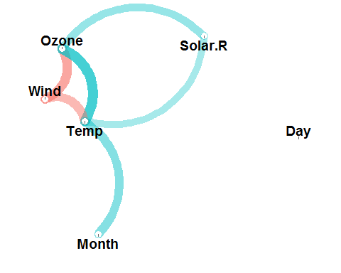

corrr
================

<!-- README.md is generated from README.Rmd. Please edit that file -->
[](http://www.repostatus.org/#active) [](https://cran.r-project.org/) [](https://cran.r-project.org/package=corrr) [](commits/master) [](/commits/master) [](https://travis-ci.org/drsimonj/corrr) [](http://cran.rstudio.com/web/packages/corrr/index.html)

corrr is a package for exploring **corr**elations in **R**. It focuses on creating and working with **data frames** of correlations (instead of matrices) that can be easily explored via corrr functions or by leveraging tools like those in the [tidyverse](http://tidyverse.org/). This, along with the primary corrr functions, is represented below:


You can install:

-   the latest released version from CRAN with

``` r
install.packages("corrr")
```

-   the latest development version from github with

``` r
install.packages("devtools")  # run this line if devtools is not installed
devtools::install_github("drsimonj/corrr")
```

Using corrr
-----------

Using `corrr` typically starts with `correlate()`, which acts like the base correlation function `cor()`. It differs by defaulting to pairwise deletion, and returning a correlation data frame (`cor_df`) of the following structure:

-   A `tbl` with an additional class, `cor_df`
-   An extra "rowname" column
-   Standardised variances (the matrix diagonal) set to missing values (`NA`) so they can be ignored.

### API

The corrr API is designed with data pipelines in mind (e.g., to use `%>%` from the magrittr package). After `correlate()`, the primary corrr functions take a `cor_df` as their first argument, and return a `cor_df` or `tbl` (or output like a plot). These functions serve one of three purposes:

Internal changes (`cor_df` out):

-   `shave()` the upper or lower triangle (set to NA).
-   `rearrange()` the columns and rows based on correlation strengths.

Reshape structure (`tbl` or `cor_df` out):

-   `focus()` on select columns and rows.
-   `stretch()` into a long format.

Output/visualisations (console/plot out):

-   `fashion()` the correlations for pretty printing.
-   `rplot()` the correlations with shapes in place of the values.
-   `network_plot()` the correlations in a network.

Examples
--------

``` r
library(MASS)
library(corrr)
set.seed(1)

# Simulate three columns correlating about .7 with each other
mu <- rep(0, 3)
Sigma <- matrix(.7, nrow = 3, ncol = 3) + diag(3)*.3
seven <- mvrnorm(n = 1000, mu = mu, Sigma = Sigma)

# Simulate three columns correlating about .4 with each other
mu <- rep(0, 3)
Sigma <- matrix(.4, nrow = 3, ncol = 3) + diag(3)*.6
four <- mvrnorm(n = 1000, mu = mu, Sigma = Sigma)

# Bind together
d <- cbind(seven, four)
colnames(d) <- paste0("v", 1:ncol(d))

# Insert some missing values
d[sample(1:nrow(d), 100, replace = TRUE), 1] <- NA
d[sample(1:nrow(d), 200, replace = TRUE), 5] <- NA

# Correlate
x <- correlate(d)
class(x)
#> [1] "cor_df"     "tbl_df"     "tbl"        "data.frame"
x
#> # A tibble: 6 × 7
#>   rowname            v1          v2           v3            v4          v5
#>     <chr>         <dbl>       <dbl>        <dbl>         <dbl>       <dbl>
#> 1      v1            NA  0.70986371  0.709330652  0.0001947192 0.021359764
#> 2      v2  0.7098637068          NA  0.697411266 -0.0132575510 0.009280530
#> 3      v3  0.7093306516  0.69741127           NA -0.0252752456 0.001088652
#> 4      v4  0.0001947192 -0.01325755 -0.025275246            NA 0.421380212
#> 5      v5  0.0213597639  0.00928053  0.001088652  0.4213802123          NA
#> 6      v6 -0.0435135083 -0.03383145 -0.020057495  0.4424697437 0.425441795
#> # ... with 1 more variables: v6 <dbl>
```

As a `tbl`, we can use functions from data frame packages like `dplyr`, `tidyr`, `ggplot2`:

``` r
library(dplyr)

# Filter rows by correlation size
x %>% filter(v1 > .6)
#> # A tibble: 2 × 7
#>   rowname        v1        v2        v3          v4          v5
#>     <chr>     <dbl>     <dbl>     <dbl>       <dbl>       <dbl>
#> 1      v2 0.7098637        NA 0.6974113 -0.01325755 0.009280530
#> 2      v3 0.7093307 0.6974113        NA -0.02527525 0.001088652
#> # ... with 1 more variables: v6 <dbl>
```

corrr functions work in pipelines (`cor_df` in; `cor_df` or `tbl` out):

``` r
x <- datasets::mtcars %>%
       correlate() %>%    # Create correlation data frame (cor_df)
       focus(-cyl, -vs, mirror = TRUE) %>%  # Focus on cor_df without 'cyl' and 'vs'
       rearrange() %>%  # rearrange by correlations
       shave() # Shave off the upper triangle for a clean result
       
fashion(x)
#>   rowname   am drat gear   wt disp  mpg   hp qsec carb
#> 1      am                                             
#> 2    drat  .71                                        
#> 3    gear  .79  .70                                   
#> 4      wt -.69 -.71 -.58                              
#> 5    disp -.59 -.71 -.56  .89                         
#> 6     mpg  .60  .68  .48 -.87 -.85                    
#> 7      hp -.24 -.45 -.13  .66  .79 -.78               
#> 8    qsec -.23  .09 -.21 -.17 -.43  .42 -.71          
#> 9    carb  .06 -.09  .27  .43  .39 -.55  .75 -.66
rplot(x)
```


``` r

datasets::airquality %>% 
  correlate() %>% 
  network_plot(min_cor = .2, legend = TRUE)
```


