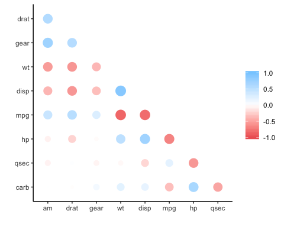
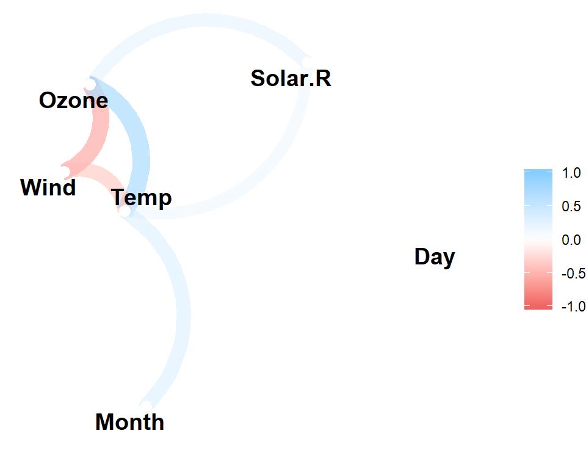

<!-- README.md is generated from README.Rmd. Please edit that file -->

# corrr 

[](https://travis-ci.org/tidymodels/corrr)
[](https://cran.r-project.org/package=corrr)

corrr is a package for exploring **corr**elations in **R**. It focuses
on creating and working with **data frames** of correlations (instead of
matrices) that can be easily explored via corrr functions or by
leveraging tools like those in the [tidyverse](http://tidyverse.org/).
This, along with the primary corrr functions, is represented below:


You can install:

  - the latest released version from CRAN with

<!-- end list -->

``` r
# install.packages("corrr")
```

  - the latest development version from GitHub with

<!-- end list -->

``` r
# install.packages("remotes") 
# remotes::install_github("drsimonj/corrr")
```

## Using corrr

Using `corrr` typically starts with `correlate()`, which acts like the
base correlation function `cor()`. It differs by defaulting to pairwise
deletion, and returning a correlation data frame (`cor_df`) of the
following structure:

  - A `tbl` with an additional class, `cor_df`
  - An extra “rowname” column
  - Standardised variances (the matrix diagonal) set to missing values
    (`NA`) so they can be ignored.

### API

The corrr API is designed with data pipelines in mind (e.g., to use
`%>%` from the magrittr package). After `correlate()`, the primary corrr
functions take a `cor_df` as their first argument, and return a `cor_df`
or `tbl` (or output like a plot). These functions serve one of three
purposes:

Internal changes (`cor_df` out):

  - `shave()` the upper or lower triangle (set to NA).
  - `rearrange()` the columns and rows based on correlation strengths.

Reshape structure (`tbl` or `cor_df` out):

  - `focus()` on select columns and rows.
  - `stretch()` into a long format.

Output/visualisations (console/plot out):

  - `fashion()` the correlations for pretty printing.
  - `rplot()` the correlations with shapes in place of the values.
  - `network_plot()` the correlations in a network.

## Examples

``` r
library(MASS)
library(corrr)
set.seed(1)

# Simulate three columns correlating about .7 with each other
mu <- rep(0, 3)
Sigma <- matrix(.7, nrow = 3, ncol = 3) + diag(3)*.3
seven <- mvrnorm(n = 1000, mu = mu, Sigma = Sigma)

# Simulate three columns correlating about .4 with each other
mu <- rep(0, 3)
Sigma <- matrix(.4, nrow = 3, ncol = 3) + diag(3)*.6
four <- mvrnorm(n = 1000, mu = mu, Sigma = Sigma)

# Bind together
d <- cbind(seven, four)
colnames(d) <- paste0("v", 1:ncol(d))

# Insert some missing values
d[sample(1:nrow(d), 100, replace = TRUE), 1] <- NA
d[sample(1:nrow(d), 200, replace = TRUE), 5] <- NA

# Correlate
x <- correlate(d)
class(x)
#> [1] "cor_df"     "tbl_df"     "tbl"        "data.frame"
x
#> # A tibble: 6 x 7
#>   rowname       v1      v2      v3      v4       v5      v6
#>   <chr>      <dbl>   <dbl>   <dbl>   <dbl>    <dbl>   <dbl>
#> 1 v1      NA        0.696   0.705   0.0137  0.00906 -0.0467
#> 2 v2       0.696   NA       0.697  -0.0133  0.0221  -0.0338
#> 3 v3       0.705    0.697  NA      -0.0253 -0.0166  -0.0201
#> 4 v4       0.0137  -0.0133 -0.0253 NA       0.452    0.442 
#> 5 v5       0.00906  0.0221 -0.0166  0.452  NA        0.425 
#> 6 v6      -0.0467  -0.0338 -0.0201  0.442   0.425   NA
```

As a `tbl`, we can use functions from data frame packages like `dplyr`,
`tidyr`, `ggplot2`:

``` r
library(dplyr)

# Filter rows by correlation size
x %>% filter(v1 > .6)
#> # A tibble: 2 x 7
#>   rowname    v1     v2     v3      v4      v5      v6
#>   <chr>   <dbl>  <dbl>  <dbl>   <dbl>   <dbl>   <dbl>
#> 1 v2      0.696 NA      0.697 -0.0133  0.0221 -0.0338
#> 2 v3      0.705  0.697 NA     -0.0253 -0.0166 -0.0201
```

corrr functions work in pipelines (`cor_df` in; `cor_df` or `tbl` out):

``` r
x <- datasets::mtcars %>%
       correlate() %>%    # Create correlation data frame (cor_df)
       focus(-cyl, -vs, mirror = TRUE) %>%  # Focus on cor_df without 'cyl' and 'vs'
       rearrange() %>%  # rearrange by correlations
       shave() # Shave off the upper triangle for a clean result
#> 
#> Correlation method: 'pearson'
#> Missing treated using: 'pairwise.complete.obs'
#> Registered S3 method overwritten by 'seriation':
#>   method         from 
#>   reorder.hclust gclus
       
fashion(x)
#>   rowname  mpg drat   am gear qsec carb   hp   wt disp
#> 1     mpg                                             
#> 2    drat  .68                                        
#> 3      am  .60  .71                                   
#> 4    gear  .48  .70  .79                              
#> 5    qsec  .42  .09 -.23 -.21                         
#> 6    carb -.55 -.09  .06  .27 -.66                    
#> 7      hp -.78 -.45 -.24 -.13 -.71  .75               
#> 8      wt -.87 -.71 -.69 -.58 -.17  .43  .66          
#> 9    disp -.85 -.71 -.59 -.56 -.43  .39  .79  .89
rplot(x)
#> Don't know how to automatically pick scale for object of type noquote. Defaulting to continuous.
```

<!-- -->

``` r

datasets::airquality %>% 
  correlate() %>% 
  network_plot(min_cor = .2)
#> 
#> Correlation method: 'pearson'
#> Missing treated using: 'pairwise.complete.obs'
```

<!-- -->
